# Runink Architecture: Go/Linux Native Distributed Data Environment

Self-sufficient, distributed environment for orchestrating and executing data pipelines using Go and Linux primitives. This system acts as the cluster resource manager and scheduler (replacing Slurm), provides Kubernetes-like logical isolation and RBAC, integrates data governance features, and ensures robust security and observability. It aims for high efficiency by avoiding traditional virtualization or container runtimes like Docker. Define a self-sufficient, distributed environment for orchestrating and executing data pipelines using Go and Linux primitives, with enhanced metadata capabilities designed to support standard data governance (lineage, catalog) AND future integration of LLM-generated annotations.

## High-Level Architecture

Runink operates with a Control Plane managing multiple Worker Nodes, each running a Runi Agent.


### Runi Agent / Worker slice channels orchesrtration

Ephemeral UIDs & mTLS
Each slice runs as:
- A **non-root ephemeral user**
- With an **Herd-specific UID/GID**
- In an **isolated namespace**
- Authenticated over mTLS via service tokens

```mermaid
flowchart TD
    A["Runi Agent<br/>(PID 1 inside namespace)"] --> B["Launch Slice<br/>(Normalize step)"]
    B --> C1["io.Pipe() Reader<br/>→ Goroutine: Validate step"]
    B --> C2["io.Pipe() Reader<br/>→ Goroutine: Enrich step"]
    B --> D["Final Writer<br/>(sink to disk or message bus)"]
```




### Core Principles

* **User Interaction:** Client requests are often scoped to a specific Herd.
* **API Server / RBAC:** Enforces RBAC policies based on user/service account permissions within a target Herd.
* **Cluster State Store:** Explicitly stores Herd definitions and their associated resource quotas.
* **Scheduler:** Considers Herd-level quotas when making placement decisions.
* **Secrets Manager:** Access to secrets might be scoped by Herd.
* **Data Governance:** Metadata (lineage, annotations) can be tagged by or associated with the Herd it belongs to.
* **Runi Agent:** Receives the target Herd context when launching a slice and uses this information to potentially configure namespaces and apply appropriate cgroup limits based on Herd quotas.
* **Runi Slice:** A single instance of a pipeline step running as an isolated Worker Slice Process. Executes entirely within the logical boundary and resource constraints defined by its assigned Herd.
* **Runi Pipes:** Primarily used now for internal communication within the `Runi Agent` to capture logs/stdio from the `Runi Slice` it `exec`s, rather than for primary data transfer between steps.
* **Herd:** A logical grouping construct, similar to a Kubernetes Namespace, enforced via RBAC policies and potentially mapped to specific sets of Linux namespaces managed by Agents. Provides multi-tenancy and team isolation. Quotas can be applied per Herd.
* **Go Native & Linux Primitives:** Core components written in Go, directly leveraging cgroups, namespaces (user, pid, net, mount, uts, ipc), pipes, sockets, and `exec` for execution and isolation.
* **Self-Contained Cluster Management:** Manages a pool of physical or virtual machines, schedules workloads onto them, and handles node lifecycle.
* **Serverless Execution Model:** Users define pipelines and resource requests; Runink manages node allocation, scheduling, isolation, scaling (by launching more slices), and lifecycle. Users are subject to quotas managed via cgroups.
* **Security First:** Integrated identity (OIDC), RBAC, secrets management, network policies, encryption in transit/rest.
* **Data Governance Aware:** Built-in metadata tracking, lineage capture, and support for quality checks. With extension for storage/management of rich data annotations (e.g., from LLMs).
* **Rich Observability:** Native support for metrics (Prometheus) and logs (Fluentd).

---

# Runink’s Execution Overview

Runink executes data pipelines using **Go "slices"** — lightweight, isolated execution units designed to model both **bounded** (batch) and **unbounded** (streaming) data workloads. These are:

- Spawned by the **Runi agent** on worker nodes
- Executed as **isolated processes**
- Scoped to **Herd namespaces**
- Constrained by **cgroups**
- Communicate via **pipes**, **sockets**, or **gRPC streams**

This orchestration is **Raft-coordinated**, making every launch deterministic, fault-tolerant, and observable.

---

## 🧬 What Are Bounded and Unbounded Slices?

| Type         | Use Case                            | Description |
|--------------|-------------------------------------|-------------|
| **Bounded**  | Batch ETL, contract validation       | Processes a finite dataset and terminates |
| **Unbounded**| Streaming ingestion, log/event flows | Long-running, backpressured pipelines with checkpointing |

Both types run as **Go processes** within a controlled **Herd namespace**, and can be composed together in DAGs.

---

## 🧰 Slice Internals: Go + Linux Synergy

Each slice is a **native Go process** managed via:

### ✅ Cgroups
- Applied per Herd, per slice
- Limits on CPU, memory, I/O
- Enforced using Linux `cgroupv2` hierarchy
- Supports slice preemption and fair resource sharing

### ✅ Namespaces
- User, mount, network, and PID namespaces
- Enforce isolation between tenants (Herds)
- Prevent noisy-neighbor problems and info leaks

### ✅ Pipes & IPC
- Use of `os.Pipe()` or `io.Pipe()` in Go to model stage-to-stage communication
- `net.Pipe()` and UNIX domain sockets for local transport
- Optionally enhanced via `io.Reader`, `bufio`, or gRPC streams (for cross-node slices)

### ✅ Execution
- `os/exec` with setns(2) and clone(2) to launch each slice
- Environment-injected config and secrets fetched securely via Raft-backed Secrets Manager

---

## 🔄 Raft as Execution Backbone

The **Barn (Cluster State Store)** is Raft-backed. It ensures:

| Raft Role     | Benefit to Runink                                      |
|---------------|---------------------------------------------------------|
| **Leader Election** | Prevents race conditions in pipeline launches |
| **Log Replication** | Guarantees all agents/schedulers share same DAG, lineage, and config |
| **Strong Consistency** | Execution decisions are deterministic and audit-traceable |
| **Fault Tolerance** | Node crashes do not corrupt state or duplicate work |

**Examples of Raft-integrated flows:**
- DAG submission is a Raft log entry
- Herd quota changes update slice scheduling state
- DLQ routing is replicated for contract validation violations
- Slice termination is consensus-driven (no orphaned processes)

---

## Programming Approaches: Why They Power Runink

Runink’s architecture isn’t just Go-native — it’s intentionally designed around a few **low-level but high-impact programming paradigms**. These concepts are what let Runink outperform containerized stacks, enforce security without overhead, and keep pipelines testable, composable, and fast. Runink takes a radically different approach to pipeline execution than traditional data platforms — instead of running heavy containers, JVMs, or external orchestrators, Runink uses **Go-native workers**, Linux primitives like **cgroups and namespaces**, and concepts like **data-oriented design and zero-copy streaming** to deliver **blazing-fast, memory-stable, and secure slices**.

Below, we walk through the four core techniques and where they show up in Runink’s components.

---

### 🔄 1. **Functional Pipelines**
_"Like talking how your data flow over high-level functions."_

Runink's `.dsl` compiles to Go transforms that behave like **pure functions**: they take input (usually via `io.Reader`), apply a deterministic transformation, and emit output (via `io.Writer`). There's no shared mutable state, no side effects — just **clear dataflow**.

This makes pipelines:
- **Composable**: steps can be reused across domains
- **Testable**: golden tests assert input/output correctness
- **Deterministic**: behavior doesn't depend on cluster state

✅ **Why it matters:** It brings **unit testability** and **DAG clarity** to data pipelines — without needing a centralized scheduler or stateful orchestrator.

---
### 2. **Data-Oriented Design (DOD)**
_"Design for the CPU, not the developer."_

Instead of modeling data as deeply nested structs or objects, Runink favors **flat, contiguous Go structs**. This aligns memory layout with CPU cache lines and avoids heap thrashing. This is especially important for Runink’s slice execution and contract validation stages, where predictable access to batches of structs (records) matters. 

- Contracts are validated by scanning `[]struct` batches in tight loops.
- Pointers and indirection are minimized for GC performance.
- Contracts power both validation and golden test generation.
- Use slices of structs over slices of pointers to enable **CPU cache locality**.
- Align field access with columnar memory usage if streaming transforms run across many rows.
- Preallocate buffers in `Runi Agent`’s slice execution path to avoid GC churn.

---

#### Core Idea:  
Layout memory for how it will be accessed, not how it's logically grouped. Runink’s slices often scan, validate, or enrich large batches of records — so struct layout, batching, and memory predictability **directly impact performance**.

#### Apply DOD in Runink:
- Prefer **flat structs over nested ones** in contracts:
  ```go
  // Better
  type User struct {
    ID    string
    Name  string
    Email string
  }

  // Avoid: nested fields unless necessary
  type User struct {
    Meta struct {
      ID string
    }
    Profile struct {
      Name string
      Email string
    }
  }
  ```


#### In `runi slice`:
- Use `sync.Pool` for reusable buffers (especially JSON decoding).
- Pre-size buffers based on contract hints (e.g., `maxRecords=10000`).
- Avoid interface{} — use generated structs via `go/types` or `go:generate`.

#### Benefits: 
- Better **memory throughput**, fewer allocations, and **Go GC-friendliness** under load.
- Use **structs of arrays (SoA)** or `[]User` with preallocated slices in transformations.
- Minimize pointer indirection. Use value receivers and avoid `*string`, `*int` unless you need nil.
- Design transforms that operate in **tight loops**, e.g., `for _, rec := range batch`.
- Go structs are faster to iterate over than Python dictionaries or Java POJOs.
- Access patterns align with how CPUs fetch and cache data.
- Contract validation and transforms run over **preallocated `[]struct` batches**, not heap-bound objects.

💡 *For Python/Java devs:* Think of this like switching from `dicts of dicts` to **NumPy-like** flat arrays — but in Go, with static types and no GC spikes.

✅ **Why it matters:** You get **predictable memory use** and **cache-friendly validation** at slice scale — perfect for CPU-bound ETL or large-batch processing.

---

### 3. **Zero-Copy and Streaming Pipelines**
_"Avoid full in-memory materialization — process as the data flows."_

Instead of `[]record → transform → []record`, Runink pipelines follow **`stream → transform → stream`** — minimizing allocations and maximizing throughput. Avoid unnecessary data marshaling or full deserialization. Rely on:

- Transforms consume from `io.Reader` and emit to `io.Writer`.
- Stages communicate via `os.Pipe()`, `net.Pipe()`, or `chan Record` for intra-slice streaming.
- Only materialize records **when needed for validation or transformation**.
- Intermediate results never fully materialize in memory.

---

#### Core Idea:
Instead of `[]Record -> Transform -> []Record`, operate on **streams of bytes or structs** using `io.Reader`, `chan Record`, or even UNIX pipes between stages.

#### Runink Optimizations:
- Use **`io.Reader → Decoder → Transform → Encoder → io.Writer`** chain.
- Design step transforms like this:

  ```go
  func ValidateUser(r io.Reader, w io.Writer) error {
    decoder := json.NewDecoder(r)
    encoder := json.NewEncoder(w)

    for decoder.More() {
      var user contracts.User
      if err := decoder.Decode(&user); err != nil {
        return err
      }
      if isValid(user) {
        encoder.Encode(user)
      }
    }
    return nil
  }
  ```

- For multi-stage slices, use **`os.Pipe()`**:
  ```go
  r1, w1 := os.Pipe()
  r2, w2 := os.Pipe()

  go Normalize(r0, w1) // input -> step 1
  go Enrich(r1, w2)    // step 1 -> step 2
  go Sink(r2, out)     // step 2 -> sink
  ```

#### Benefits:
- **Constant memory** even for massive datasets.
- **Backpressure**: If downstream slows down, upstream blocks — great for streaming (Kafka, etc.).
- Enables **DLQ teeing**: `tee := io.MultiWriter(validOut, dlqSink)`.
- Uses `io.Reader` / `io.Writer` rather than buffering everything in memory.
- Transforms run as **pipes between goroutines** — like UNIX but typed.
- Memory stays flat, predictable, and bounded — even for 10M+ record streams.

💡 *For pandas/Spark devs:* This is closer to **generator pipelines** or **structured stream micro-batches**, but with Go’s backpressure-aware channels and streaming codecs.

✅ **Why it matters:** You can process **unbounded streams or 100GB batch files** with a stable memory footprint — and gain built-in **backpressure and DLQ support**.

---

### 4. **Declarative Scheduling with Constraint Propagation**
_"Schedule via logic, not instructions."_
The `Herd` and `Runi Agent` coordination already benefits from Raft-backed state, but push it further with **affinity-aware, declarative scheduling**:

Runink doesn’t assign slices imperatively. It **solves** where to run things, based on:
- Isolation: `@herd("analytics")`
- Define **resource constraints** (e.g., `@requires(cpu=2, memory=512Mi, label=“gpu”)`) in `.dsl`.
- Placement: `@affinity(colocate_with="step:Join")`
- Propagate **slice placement decisions** through constraint-solving logic instead of imperative scheduling.
- Record constraints in the Raft-backed state store to enforce deterministic task placement.

You can build this as a small DSL-on-DSL layer (e.g. `@affinity(domain="finance", colocate_with="step:JoinUsers")`).

*Benefit:* Stronger **determinism**, **replayability**, and **multi-tenant safety**.

#### Core Idea:
Model placement as a **set of constraints**: affinity, herd quota, GPU needs, tenant isolation, etc. Let the scheduler **solve** the placement rather than being told where to run.

#### Runink DSL Extension:
In `.dsl`:

```gherkin
@step("RunLLMValidation")
@affinity(label="gpu", colocate_with="step:ParsePDFs")
@requires(cpu="4", memory="2Gi")
```

This can be compiled into metadata stored in the Raft-backed scheduler store.

#### Scheduler Logic (Pseudo-Go):
```go
type Constraints struct {
  CPU       int
  Memory    int
  Affinity  string
  Colocate  string
  HerdScope string
}

func ScheduleStep(stepID string, constraints Constraints) (NodeID, error) {
  candidates := filterByHerd(constraints.HerdScope)
  candidates = filterByResources(candidates, constraints.CPU, constraints.Memory)
  if constraints.Colocate != "" {
    candidates = colocateWith(candidates, constraints.Colocate)
  }
  if constraints.Affinity != "" {
    candidates = matchLabel(candidates, constraints.Affinity)
  }
  return pickBest(candidates)
}
```

These constraints are stored in the Raft-backed `Barn` and evaluated by the scheduler. In this sense, all decisions are **Raft-logged**, making slice scheduling **auditable and replayable**.

💡 *If you're used to Kubernetes or Docker:* Think of slices as **ephemeral containers, but 10x faster** — no image pulls, no pod scheduling latency. No containers, no clusters — just data pipelines that behave like code.

✅ **Why it matters:** Runink achieves **multi-tenant safety, fault-tolerant execution, and reproducible placement** — without complex K8s YAML or retries.

---

### Summary Table

| **Approach**               | **Use In Runink**                                             | **Why It Powers Runink**                         |
|----------------------------|---------------------------------------------------------------|--------------------------------------------------|
| Functional Pipelines       | `.dsl` → Go transforms via `@step()`                          | Clear transforms, reusable logic, golden testing |
| Data-Oriented Design       | Contract enforcement, slice internals                         | Memory locality, low-GC, CPU-efficient pipelines |
| Zero-Copy Streaming        | Slice-to-slice transport, pipe-to-pipe steps                  | Constant memory, streaming support, low latency  |
| Declarative Scheduling     | Herd quotas + slice placement affinity in `.dsl` raft store   | Deterministic, fair, replayable orchestration    |

---

## Future LLM Integration

1. **Pipeline Definition:** A user defines a pipeline step specifically for LLM annotation. This step specifies the input data source (e.g., path on shared FS/MinIO), the target LLM (e.g., OpenAI model name or internal service endpoint), the prompt, and potentially the output format.
2. **Scheduling:** The `Scheduler` assigns this step to a `Runi Agent`. If targeting an internal LLM requiring specific hardware (GPU), the scheduler uses node resource information (reported by Agents) for placement.
3. **Execution:** The `Runi Agent` launches a `Worker Slice Process` for this step.
4. **Credentials:** The Worker Slice receives necessary credentials (e.g., OpenAI API key, MinIO access key) securely via the `Secrets Manager`.
5. **LLM Call:** The worker reads input data, constructs the prompt, calls the relevant LLM API (external or internal), potentially handling batching or retries.
6. **Metadata Persistence:** Upon receiving results, the worker extracts the annotations, formats them according to the `Data Governance Service` schema, and sends them via gRPC call to the service, linking them to the input data reference. It also reports standard lineage (input data -> LLM step -> annotations).
7. **Usage:** Downstream pipeline steps or external users can then query the `Data Governance Service` (via `API Server`) to retrieve these annotations for further processing, reporting, or analysis.
