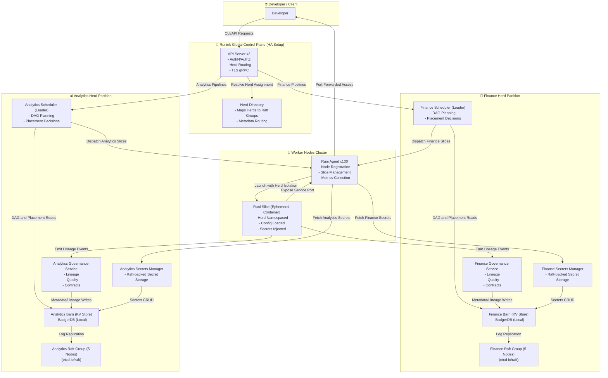
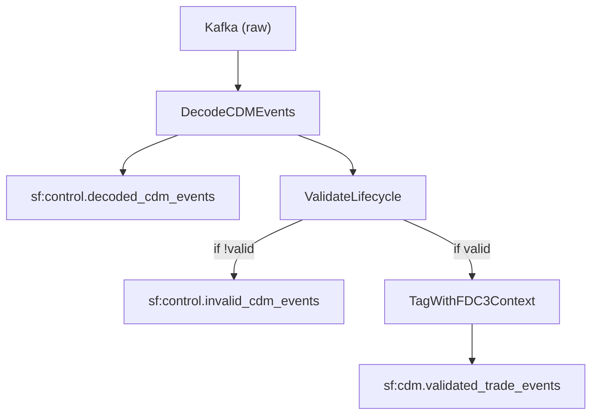

# 🚀 Runink Quickstart: CDM Trade Pipeline

This example shows how to define, test, apply, and run a declarative data pipeline using Runink.

---

## Environment scenario



## 🛠️ Prerequisites

Ensure you have:

- A `.dsl` scenario: `features/cdm_trade/trade_cdm.dsl`
- A Go contract file: `contracts/trade_cdm_multi.go`
- Golden test files: `golden/cdm_trade/`
- Sample input data: `golden/cdm_trade/input.json`

Our example presents the following:



---

## 💡 Example Flow

```bash
# Create a secure namespace (herd)
runi herd init finance
runi compile --scenario features/payment.dsl --herd finance --contract contracts/payment.go --out dags/payment.go
runi run --dag dags/payment.go
```
---

## 🧪 Test Your Pipelines

```bash
runi audit --scenario features/payment.dsl --contract contracts/payment.go --golden tests/input.json
runi synth --scenario features/payment.dsl --contract contracts/payment.go --golden tests/input.json
runi fetch --scenario features/example.dsl --golden tests/input.json --output table.sql --show
```

---

## 📊 Inspect Pipeline Execution

After running, inspect the pipeline using:

```bash
runi status --run-id RUN-20240424-XYZ --herd finance
```

### Example Output

```yaml
run_id: RUN-20240424-XYZ
herd: finance
status: completed
steps:
  - DecodeCDMEvents:
      processed: 2
      output: sf://control.decoded_cdm_events
  - ValidateLifecycle:
      passed: 1
      failed: 1
      output: 
        - valid → sf://cdm.validated_trade_events
        - invalid → sf://control.invalid_cdm_events
  - TagWithFDC3Context:
      enriched: 1
      context_prefix: fdc3.instrumentView:
lineage:
  contract_hash: a9cd23f…
  contract_version: v3
  created_by: service-account:etl-runner
```

---

## 🔍 Follow-Up Commands

```bash
runi lineage --run-id RUN-20240424-XYZ
runi logs --run-id RUN-20240424-XYZ
runi publish --herd finance --scenario features/cdm_trade/cdm_trade.dsl
```

---

Runink makes secure, declarative data orchestration easy — every pipeline is testable, auditable, and reproducible.
